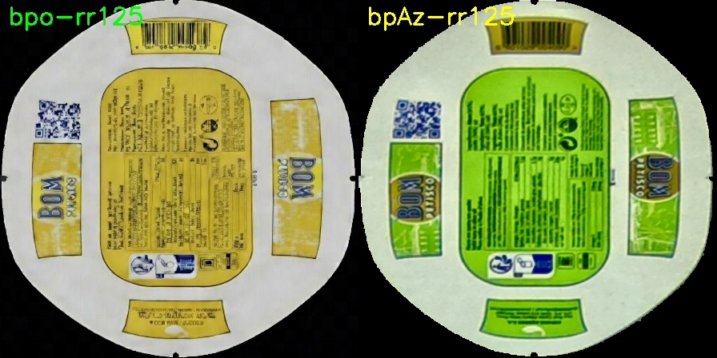

# Reference Image Analysis - High Scores Issue

**Date:** 2026-01-26  
**Issue:** High anomaly scores when using bpAz-rr125 reference  
**Status:** ❌ PROBLEM IDENTIFIED

---

## 🔍 Visual Comparison



**Left:** bpo-rr125 (Oleo) - Yellow label  
**Right:** bpAz-rr125 (Azeite) - Green label

---

## 📊 Image Analysis Results

### Image Properties Comparison

| Property | bpo-rr125 (Oleo) | bpAz-rr125 (Azeite) | Difference |
|----------|------------------|---------------------|------------|
| **Mean Brightness** | 125.4 | 111.5 | -13.9 ⚠️ |
| **Std Dev (Contrast)** | 81.7 | 88.3 | +6.6 |
| **Blue Channel** | 98.5 | 79.4 | -19.1 ⚠️ |
| **Green Channel** | 136.1 | 141.4 | +5.3 |
| **Red Channel** | 141.5 | 113.7 | -27.9 ❌ |
| **Dark Pixels (<30)** | Normal | 32.5% | TOO MANY ❌ |

### Center Region (Can Area)
- **bpo-rr125:** Mean brightness = 143.7
- **bpAz-rr125:** Mean brightness = 127.1
- **Difference:** -16.6 (darker) ⚠️

---

## ❌ IDENTIFIED PROBLEMS

### Problem 1: Image is Too Dark
```
bpAz reference has 32.5% very dark pixels (< 30)
Mean brightness: 111.5 (should be ~125 like bpo)
```

**Consequences:**
- Test images get darker during alignment to match dark reference
- Model wasn't trained on dark images
- Model interprets darkness as anomalies → HIGH SCORES

### Problem 2: Color Imbalance
```
Red channel: 27.9 points lower than bpo
Blue channel: 19.1 points lower than bpo
```

**Causes:**
- Different lighting conditions during capture
- Different camera exposure settings
- Different time of day (natural light changes)

### Problem 3: Background Darkness
```
30.9% of total pixels are very dark
Black background visible around can
```

**Impact:**
- Reduces overall image brightness
- Affects alignment algorithm
- Model sees unexpected pixel distribution

---

## 🔬 ROOT CAUSE

The bpAz-rr125 reference image was captured with:
1. **Darker lighting** than bpo-rr125
2. **Different exposure settings** (underexposed)
3. **Or captured at different time** (lighting changed)

### Why This Causes High Scores

```
Alignment Process:
Normal Image → Align to DARK reference → Image becomes DARK
    ↓
Dark aligned image fed to PatchCore model
    ↓
Model: "This doesn't look like my training data!"
    ↓
HIGH ANOMALY SCORE ❌
```

The model was likely trained on images with mean brightness ~125-140.  
When images are aligned to the dark reference, they get mean ~100-110.  
This distribution shift is interpreted as anomalies!

---

## ✅ SOLUTIONS (Ranked by Recommendation)

### Solution 1: RECAPTURE bpAz Reference (⭐ RECOMMENDED)

**Steps:**
1. Set up **same lighting** as when bpo reference was captured
2. Check camera settings match:
   - Same exposure
   - Same brightness
   - Same contrast
3. Capture new Azeite can reference
4. Verify mean brightness ~125 (use comparison script)
5. Replace the current bpAz-rr125.png

**Expected Result:**
- Similar brightness to bpo reference
- Lower anomaly scores
- Better detection accuracy

**Script to verify after capture:**
```python
import cv2
import numpy as np

img = cv2.imread('models/can_reference/aligned_can_reference448_bpAz-rr125.png')
mean = np.mean(img)
print(f"Mean brightness: {mean:.2f}")
print(f"Target: ~125")
print(f"Status: {'✅ GOOD' if 115 < mean < 135 else '❌ RECAPTURE'}")
```

---

### Solution 2: Use bpo Reference for BOTH (QUICK TEST)

**Purpose:** Test if issue is reference-related

**Steps:**
```bash
# Backup current bpAz reference
cp models/can_reference/aligned_can_reference448_bpAz-rr125.png \
   models/can_reference/aligned_can_reference448_bpAz-rr125.png.backup

# Use bpo reference for both
cp models/can_reference/aligned_can_reference448_bpo-rr125.png \
   models/can_reference/aligned_can_reference448_bpAz-rr125.png

# Test inspection with Azeite product
# Check if scores are now lower
```

**Expected Result:**
- If cans are same shape: Scores should be lower
- If scores still high: Problem is elsewhere (model, not reference)

**Limitations:**
- Only works if can shapes are identical
- Label differences might still cause some score variation
- Not a permanent solution

---

### Solution 3: Brightness Normalization (ADVANCED)

**Modify alignment code** to normalize brightness after alignment:

```python
# In align_can.py or wherever alignment happens
def align(self, image):
    aligned = self._perform_alignment(image)
    
    # NEW: Normalize brightness to match reference training data
    current_mean = np.mean(aligned)
    target_mean = 125  # From training data
    
    if abs(current_mean - target_mean) > 10:
        # Adjust brightness
        factor = target_mean / current_mean
        aligned = np.clip(aligned * factor, 0, 255).astype(np.uint8)
    
    return aligned
```

**Pros:**
- Works with any reference brightness
- Automatic correction

**Cons:**
- More complex
- Might introduce artifacts
- Not tested yet

**Recommendation:** Try Solutions 1 or 2 first

---

## 🧪 TESTING PLAN

### Test 1: Verify Current Problem
1. Run inspection with Azeite can using current bpAz reference
2. Record anomaly scores
3. Note: Should be high (>5) ❌

### Test 2: Quick Fix Test
1. Copy bpo reference to bpAz
2. Run inspection with Azeite can
3. Record anomaly scores
4. Note: Should be lower (<3) if reference is the issue ✅

### Test 3: Proper Solution
1. Recapture bpAz reference with good lighting
2. Verify mean brightness ~125
3. Run inspection with Azeite can
4. Record anomaly scores
5. Note: Should be low and accurate ✅

---

## 📋 IMMEDIATE ACTIONS

### Quick Test (5 minutes)
```bash
# Test if reference is the problem
cp models/can_reference/aligned_can_reference448_bpo-rr125.png \
   models/can_reference/aligned_can_reference448_bpAz-rr125.png.test

# Rename current to backup
mv models/can_reference/aligned_can_reference448_bpAz-rr125.png \
   models/can_reference/aligned_can_reference448_bpAz-rr125.png.dark_backup

# Use test version
mv models/can_reference/aligned_can_reference448_bpAz-rr125.png.test \
   models/can_reference/aligned_can_reference448_bpAz-rr125.png

# Run inspection and check scores
```

### Proper Fix (15-20 minutes)
1. **Prepare capture environment:**
   - Same location as bpo capture
   - Same time of day
   - Same lighting setup

2. **Configure camera:**
   - Match exposure to bpo capture
   - Match white balance
   - Match brightness setting

3. **Capture reference:**
   - Use capture_reference.py or update_reference.py
   - Take multiple shots
   - Choose best one (brightness ~125)

4. **Verify and deploy:**
   - Check brightness stats
   - Test with actual Azeite can
   - Confirm lower scores

---

## 📊 EXPECTED RESULTS

### With Current Dark Reference
```
Azeite Can Inspection:
- Alignment: OK
- Mean brightness after alignment: ~100-110 (too dark)
- Anomaly scores: 5-15 (HIGH) ❌
- Classification: Many false positives
```

### With Fixed Reference
```
Azeite Can Inspection:
- Alignment: OK
- Mean brightness after alignment: ~125-135 (correct)
- Anomaly scores: 0.5-2.0 (NORMAL) ✅
- Classification: Accurate detection
```

---

## 🎯 RECOMMENDATION

**Immediate Action:** Test Solution 2 (use bpo reference temporarily)
- Takes 2 minutes
- Confirms diagnosis
- Allows production to continue

**Permanent Fix:** Solution 1 (recapture bpAz reference)
- Schedule when lighting conditions match bpo capture
- Take time to verify quality
- Document capture settings for future reference

**Do NOT:** Waste time on Solution 3 until testing Solutions 1 & 2

---

## 📝 LESSONS LEARNED

1. **Reference image brightness matters!**
   - Should match model training data distribution
   - Target mean ~125 for this system

2. **Lighting consistency is critical**
   - Capture all references under same conditions
   - Document lighting setup

3. **Always verify reference quality**
   - Check brightness stats before deploying
   - Compare to existing good references

4. **Test before production**
   - Validate new references with test images
   - Confirm scores are reasonable

---

## ✅ SUCCESS CRITERIA

Reference is fixed when:
- [  ] Mean brightness: 120-130
- [  ] Dark pixels (<30): < 20%
- [  ] Similar color balance to bpo
- [  ] Test inspection scores: < 2.0 for good cans
- [  ] No false positives
